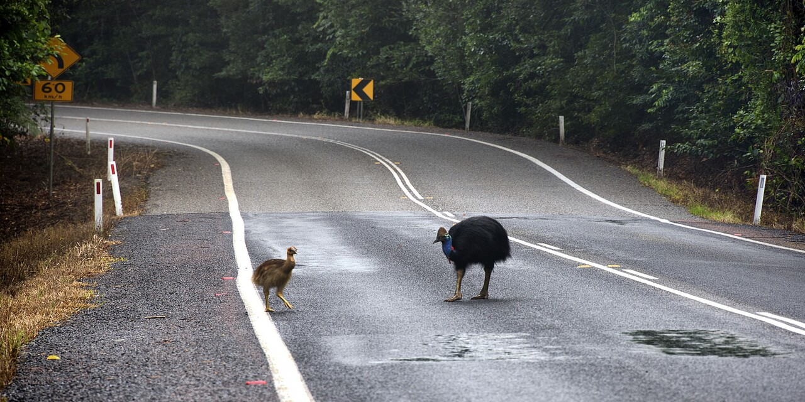

# Cass Detect
<div align="center">
    
</div>

## Introduction
This repository contains code for a self-training machine learning pipeline developed to detect cassowaries or other animals on roads and roadsides.

Contact: [kumli](https://github.com/kumli), [msha3421](https://github.com/msha3421), [Hommus](https://github.com/Hommus)

## Installation
Requirements:
- Docker
- A GPU with at least 16GB of memory

Clone the repository, then build and run the docker image 
```bash
docker buildx build -t laarma .
docker run --gpus all -it -v $PWD:/app laarma:latest
```

## Prepare Data
* Download a sample cassowary dataset (608MB) from [here](https://hdl.handle.net/2123/33034)
* Organise the file structure as follows:
```
  data                                    sample_dataset
      |- stage1                               |
          |- background
              |- images (*.jpeg)      <----   |-  background_images (*.jpeg)
          |- class_images (*.jpeg)    <----   |-  web_images (*.jpeg)
      |- stage2
          |- raw_data (*.jpeg)        <----   |-  field_images (*.jpeg)
  trainer
      |- validation
          |- images (*.jpeg)          <----   |-  validation_images (*.jpeg)
          |- labels (*.txt)           <----   |-  validation_labels (*.txt)
```
* **Note:**
  - The sample dataset is intended for illustrative purposes.
  - The sample dataset has been de-identified to address privacy concerns.
  - The performance of a model trained using the sample dataset may not match the results reported in the project report or associated papers.

## Run Example

### 1. Data Synthesis
Synthesise training data by merging images of cassowaries with various environmental backgrounds. This will improve the model's ability to recognise cassowaries in different settings.

```bash
python src/stage1.py
```

Train the object detector for use in the field.

```bash
python src/train.py --stage 1
```

### 2. Autolabel Field Data
After receiving new data from the field, we have placed it in the `data/stage2/raw_data` folder. Run the following script to autolabel it.
```bash
python src/stage2.py
```

Train the object detector again for improved performance in the field.
```bash
python src/train.py --stage 2
```

### 3. Field Data Augmentation
Adopt a similar strategy to stage 1 and synthesise data from the labelled data.
```bash
python src/stage3.py
```

After stage 3, it's recommended to rerun the training script to integrate the synthesised data, improving the overall model performance.

```bash
python src/train.py --stage 3
```


## Bring Your Own Data
* Step 1. Place images with your class of interest in `data/stage1/class_images`
* Step 2. Place images without your class of interest in `data/stage1/background/images`
* Step 3. Follow the steps from the [example](#run-example)


## Run Evaluation

To evaluate the model's performance after training, you can run the evaluation using the following command. This step uses the best model weights obtained from the previous training stages and evaluates it against a predefined validation dataset to measure its accuracy, precision, and other relevant metrics.

Run the following command in your docker container:

```bash
python src/train.py --action eval
```
